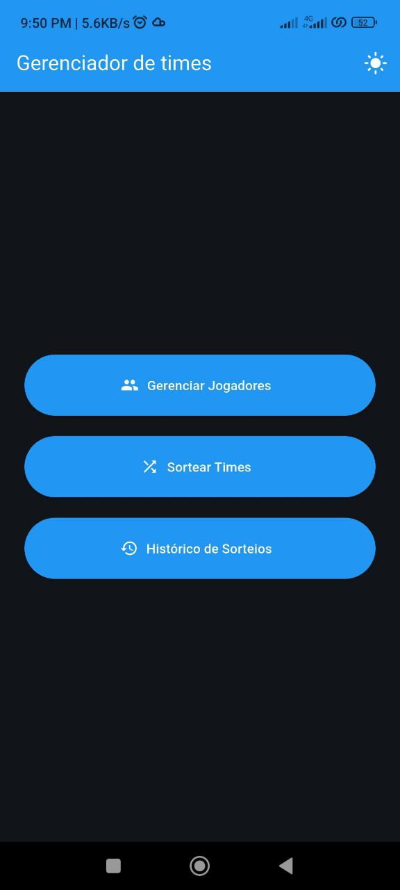
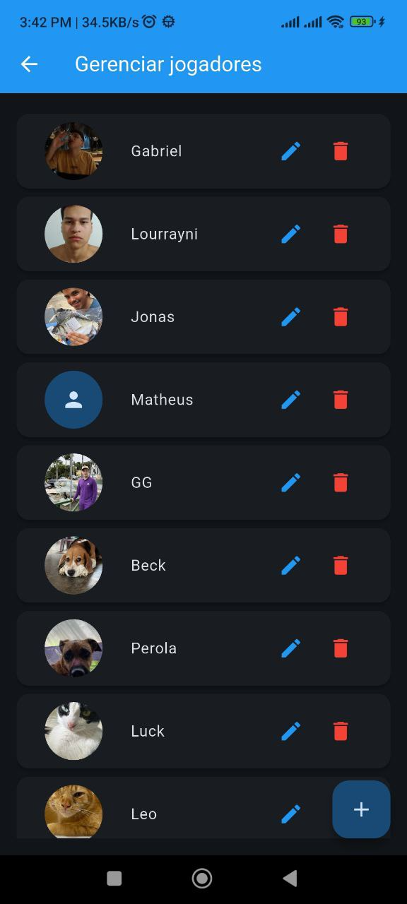
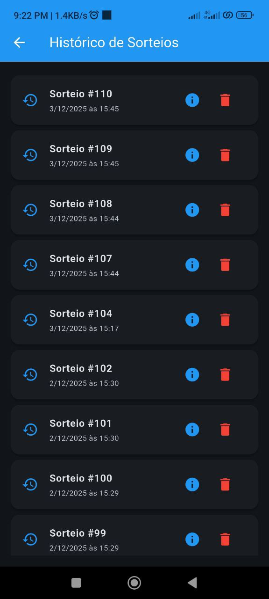

# Gerenciador de Times

Aplicativo desenvolvido em Flutter para gerenciar jogadores e sortear times equilibrados automaticamente. Ideal para organizar partidas de futebol, basquete, vôlei ou qualquer atividade esportiva que exija equipes.

<div align="center">





</div>

---

## Índice

- [Características](#-características)
- [Funcionalidades](#-funcionalidades)
- [Tecnologias](#-tecnologias)
- [Requisitos](#-requisitos)
- [Instalação](#-instalação)
- [Como Usar](#-como-usar)
- [Estrutura do Projeto](#-estrutura-do-projeto)
- [Arquitetura](#-arquitetura)
- [Algoritmo de Sorteio](#-algoritmo-de-sorteio)
- [Plataformas Suportadas](#-plataformas-suportadas)
- [Contribuindo](#-contribuindo)
- [Licença](#-licença)

---

## Características

- **Interface Moderna**: Design limpo e intuitivo com suporte a tema claro/escuro
- **Tema Personalizável**: Alternância manual entre tema claro e escuro diretamente da interface
- **Fotos de Jogadores**: Adicione fotos personalizadas para cada jogador
- **Sistema de Níveis**: Classifique jogadores de 1 a 5 estrelas para balanceamento
- **Sorteio Inteligente**: Algoritmo Snake Draft para times equilibrados
- **Histórico Completo**: Visualize todos os sorteios anteriores com data e hora
- **Persistência de Dados**: Armazenamento local com SQLite
- **Exportação**: Compartilhe os times sorteados como imagem PNG
- **Múltiplos Times**: Suporte para 2 ou mais equipes
- **Multiplataforma**: Funciona em Android, iOS, Web, Windows, Linux e macOS

---

## Funcionalidades

### Gerenciamento de Jogadores

- Adicionar jogadores com nome, foto e nível de habilidade (1-5 estrelas)
- Editar informações de jogadores existentes
- Remover jogadores da lista
- Visualizar lista completa de participantes
- Selecionar fotos da galeria para cada jogador
- Persistência automática de dados

### Sorteio de Times

- Define automaticamente equipes equilibradas usando algoritmo Snake Draft
- Suporte para 2 ou mais times
- Ordena jogadores por nível antes da distribuição
- Embaralha jogadores dentro de cada time para maior aleatoriedade
- Exibe os times formados de forma clara e visual
- Salva automaticamente cada sorteio realizado
- Recupera o último sorteio ao abrir a tela
- Exporta e compartilha os times como imagem PNG

### Histórico de Sorteios

- Visualize todos os sorteios realizados anteriormente
- Cada entrada inclui ID do sorteio, data e hora completa
- Acesse os detalhes completos de qualquer sorteio passado
- Visualize os times formados com fotos dos jogadores
- Delete sorteios antigos individualmente
- Interface organizada em lista para fácil navegação

---

## Tecnologias

### Core
- **[Flutter](https://flutter.dev/)** - Framework multiplataforma
- **[Dart](https://dart.dev/)** - Linguagem de programação

### Gerenciamento de Estado
- **[Provider](https://pub.dev/packages/provider)** - Gerenciamento de estado reativo

### Persistência de Dados
- **[sqflite](https://pub.dev/packages/sqflite)** - Banco de dados SQLite local
- **[path](https://pub.dev/packages/path)** - Manipulação de caminhos de arquivos

### Funcionalidades Adicionais
- **[image_picker](https://pub.dev/packages/image_picker)** - Seleção de imagens da galeria
- **[share_plus](https://pub.dev/packages/share_plus)** - Compartilhamento de arquivos
- **[path_provider](https://pub.dev/packages/path_provider)** - Acesso a diretórios do sistema

### Design
- **Material Design 3** - Design system moderno
- **Tema Claro/Escuro** - Suporte automático e alternância manual via botão na AppBar

---

## Requisitos

- Flutter SDK >= 3.9.2
- Dart SDK >= 3.9.2
- Android Studio / VS Code com extensão Flutter
- Para Android: Android SDK
- Para iOS: Xcode (apenas macOS)
- Para Web: Chrome ou navegador compatível
- Para Desktop: CMake (Windows/Linux) ou Xcode (macOS)

---

## Instalação

### 1. Clone o repositório

```bash
git clone https://github.com/seu-usuario/random_teams.git
cd random_teams
```

### 2. Instale as dependências

```bash
flutter pub get
```

### 3. Execute o aplicativo

```bash
# Para verificar dispositivos disponíveis
flutter devices

# Para executar em um dispositivo específico
flutter run

# Para Android
flutter run -d android

# Para iOS (apenas macOS)
flutter run -d ios
```

---

## Como Usar

### Adicionando Jogadores

1. Na tela inicial, toque em **"Gerenciar Jogadores"**
2. Toque no botão **+** (flutuante) no canto inferior direito
3. Preencha o nome do jogador
4. (Opcional) Toque no ícone de câmera para adicionar uma foto
5. Defina o nível do jogador (1 a 5 estrelas) usando os botões **-** e **+**
6. Toque em **"Adicionar"**

### Editando Jogadores

1. Na lista de jogadores, toque no ícone de **lápis** (azul) ao lado do jogador
2. Modifique as informações desejadas
3. Toque em **"Salvar"**

### Removendo Jogadores

1. Na lista de jogadores, toque no ícone de **lixeira** (vermelho) ao lado do jogador
2. Confirme a exclusão no diálogo

### Sorteando Times

1. Na tela inicial, toque em **"Sortear Times"**
2. Defina a quantidade de times desejada (mínimo 2) usando os botões **-** e **+**
3. Toque em **"Sortear Times"**
4. Os times serão exibidos automaticamente, balanceados por nível
5. (Opcional) Toque no ícone de **compartilhar** na barra superior para exportar como imagem

### Compartilhando Times

1. Após sortear os times, toque no ícone de **compartilhar** na barra superior
2. Aguarde a geração da imagem
3. Escolha o aplicativo para compartilhar (WhatsApp, Instagram, etc.)

### Visualizando Histórico de Sorteios

1. Na tela inicial, toque em **"Histórico de Sorteios"**
2. Visualize a lista de todos os sorteios realizados, ordenados do mais recente para o mais antigo
3. Toque no ícone de **informações** (azul) para ver os detalhes completos de um sorteio
4. Toque no ícone de **lixeira** (vermelho) para deletar um sorteio do histórico
5. Confirme a exclusão no diálogo exibido

### Alternando Tema

1. Em qualquer tela, localize o ícone de **sol/lua** na barra superior direita
2. Toque no ícone para alternar entre tema claro e escuro
3. A alteração é aplicada instantaneamente em toda a aplicação

---

## Estrutura do Projeto

```
lib/
├── main.dart                        # Ponto de entrada da aplicação
├── model/
│   ├── jogador.dart                # Modelo de dados do jogador
│   └── sorteio.dart                # Modelo de dados do sorteio
├── repository/
│   └── jogador_repository.dart     # Camada de acesso a dados (SQLite)
├── view/
│   ├── home_view.dart              # Tela inicial com menu
│   ├── jogadores_view.dart         # Tela de gerenciamento de jogadores
│   ├── sorteio_view.dart           # Tela de sorteio de times
│   └── historico_sorteios_view.dart # Tela de histórico de sorteios
├── viewmodel/
│   ├── jogador_viewmodel.dart      # Lógica de negócio e estado dos jogadores
│   └── tema_viewmodel.dart         # Gerenciamento de tema (claro/escuro)
└── theme/
    └── app_theme.dart              # Configurações de tema (claro/escuro)
```

---

## Arquitetura

O projeto segue o padrão **MVVM (Model-View-ViewModel)** com as seguintes camadas:

### Model
- **`Jogador`**: Representa a entidade jogador com id, nome, foto e nível

### Repository
- **`JogadorRepository`**: Gerencia todas as operações de banco de dados
  - CRUD de jogadores
  - Persistência de sorteios
  - Recuperação do último sorteio
  - Listagem de histórico de sorteios
  - Recuperação de sorteio por ID
  - Exclusão de sorteios do histórico

### ViewModel
- **`JogadorViewModel`**: Gerencia o estado da aplicação e lógica de negócio
  - Lista de jogadores
  - Times sorteados
  - Histórico de sorteios
  - Operações de imagem
  - Algoritmo de sorteio
  - Compartilhamento de resultados
  - Gerenciamento do histórico
- **`TemaViewModel`**: Gerencia o estado do tema da aplicação
  - Alternância entre tema claro e escuro
  - Persistência da preferência de tema

### View
- **`HomeView`**: Tela inicial com navegação e alternância de tema
- **`JogadoresView`**: Interface de gerenciamento de jogadores
- **`SorteioView`**: Interface de sorteio e visualização de times
- **`HistoricoSorteiosView`**: Interface de histórico de sorteios com visualização e exclusão

### State Management
- Utiliza **Provider** para gerenciamento de estado reativo
- `ChangeNotifier` para notificar mudanças de estado
- `Consumer` e `Provider.of` para acessar o estado nas views

---

## Algoritmo de Sorteio

O aplicativo utiliza o algoritmo **Snake Draft** para garantir times equilibrados:

1. **Ordenação por Nível**: Os jogadores são ordenados do maior para o menor nível
2. **Distribuição Alternada**: 
   - Rodada 1 (indo): Time 1, Time 2, Time 3, ...
   - Rodada 2 (voltando): Time N, Time N-1, Time N-2, ...
   - Rodada 3 (indo): Time 1, Time 2, Time 3, ...
   - E assim por diante...
3. **Embaralhamento Final**: Após a distribuição, os jogadores dentro de cada time são embaralhados para maior aleatoriedade

### Exemplo com 4 jogadores e 2 times:

```
Jogadores ordenados: [Jogador A (nível 5), Jogador B (nível 4), Jogador C (nível 3), Jogador D (nível 2)]

Distribuição:
- Rodada 1 (indo): A → Time 1, B → Time 2
- Rodada 2 (voltando): C → Time 2, D → Time 1

Resultado:
- Time 1: [A (nível 5), D (nível 2)] - Total: 7
- Time 2: [B (nível 4), C (nível 3)] - Total: 7
```

---

## Plataformas Suportadas

- **Android** - APK e App Bundle
- **iOS** - iPhone e iPad

---

## Identidade Visual

- **Logo**: Minimalista, voltada à prática de esportes
- **Cores**: Esquema de cores baseado em azul (Material Design 3)
- **Tema**: Suporte automático a modo claro e escuro com alternância manual
- **Ícones**: Material Icons

---

## Contribuindo

Contribuições são bem-vindas! Sinta-se à vontade para:

1. Fazer um fork do projeto
2. Criar uma branch para sua feature (`git checkout -b feature/AmazingFeature`)
3. Commit suas mudanças (`git commit -m 'Add some AmazingFeature'`)
4. Push para a branch (`git push origin feature/AmazingFeature`)
5. Abrir um Pull Request

### Sugestões de Melhorias

- [ ] Selecionar jogadores para o sorteio
- [ ] Placar e contagem de pontos
